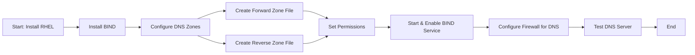

# DNS Server Setup on RHEL



## Project Overview
This project involves setting up and configuring a Domain Name System (DNS) server using **BIND** on Red 
Hat Enterprise Linux (RHEL). The DNS server will provide forward and reverse DNS lookups for internal 
network clients and can serve as an authoritative DNS server for a domain (e.g., `example.com`).

### Objective
The main goal is to deploy a functional DNS server that resolves domain names to IP addresses and vice 
versa, enabling smooth internal network operations.

## Installation and Setup

### 1. Install BIND
```bash
sudo yum install bind bind-utils
```

### 2. Configure DNS Zones

Edit the BIND configuration file `/etc/named.conf`:

```bash
sudo vi /etc/named.conf
```

Add a forward zone and a reverse zone for your domain:

```bash
zone "example.com" IN {
    type master;
    file "/var/named/example.com.zone";
};

zone "1.168.192.in-addr.arpa" IN {
    type master;
    file "/var/named/1.168.192.rev";
};
```

### 3. Create Zone Files

#### Forward Zone File: `/var/named/example.com.zone`
```bash
$TTL 86400
@   IN  SOA ns1.example.com. admin.example.com. (
        2023091801  ; Serial
        3600        ; Refresh
        1800        ; Retry
        604800      ; Expire
        86400 )     ; Minimum TTL

@       IN  NS    ns1.example.com.
ns1     IN  A     192.168.1.10
www     IN  A     192.168.1.20
mail    IN  A     192.168.1.30
```

#### Reverse Zone File: `/var/named/1.168.192.rev`
```bash
$TTL 86400
@   IN  SOA ns1.example.com. admin.example.com. (
        2023091801  ; Serial
        3600        ; Refresh
        1800        ; Retry
        604800      ; Expire
        86400 )     ; Minimum TTL

@       IN  NS    ns1.example.com.
10      IN  PTR   ns1.example.com.
20      IN  PTR   www.example.com.
30      IN  PTR   mail.example.com.
```

### 4. Start and Enable BIND

```bash
sudo systemctl start named
sudo systemctl enable named
```

### 5. Configure Firewall Rules

```bash
sudo firewall-cmd --permanent --add-service=dns
sudo firewall-cmd --reload
```

### 6. Test DNS Server

Test the DNS server using the `dig` command:

```bash
dig @192.168.1.10 www.example.com
```

Reverse lookup:

```bash
dig -x 192.168.1.20
```

## Benefits of the Project
- **Centralized Network Management**: Simplified domain name resolution for internal networks.
- **Scalability**: Easily expandable to handle more domains.
- **Security**: Configurable to work with DNSSEC.

## Challenges
- **Security**: Protecting against DNS attacks like spoofing and amplification.
- **DNS Propagation**: Changes to DNS records take time to propagate.

## Conclusion
With this guide, users can deploy a DNS server that resolves domain names and integrates with other 
network services. The project can be extended to accommodate larger networks and domains.

